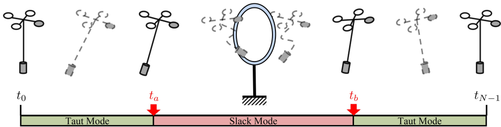

这篇论文《Impact-Aware Planning and Control for Aerial Robots With Suspended Payloads》提出了一种针对带缆绳悬挂负载的无人机系统的创新性规划与控制框架，主要贡献包括以下方面：

### 一、研究背景与挑战
1. **系统特性**：四旋翼无人机与缆绳悬挂负载系统存在两种运动模式（缆绳紧绷/松弛），导致复杂的混合动力学行为。
2. **核心问题**：
   - 模式切换时产生的冲击会破坏系统状态一致性（如图3所示）
   
   - 现有方法难以同时优化轨迹和运动模式分配

### 二、关键技术方案
1. **冲击感知规划框架**
   - 采用多项式参数化保证轨迹连续性（图5）
   
   - 建立含非线性互补约束的优化问题(ONCC)：
     ```math
     f_T(t)≥0, l_0-l(t)≥0, f_T(t)(l_0-l(t))=0
     ```
   - 改进增广拉格朗日法(ALM)求解器，结合L-BFGS和弱Wolfe条件线搜索

2. **混合非线性模型预测控制(HNMPC)**
   - 引入切换变量s∈{0,1}区分动力学模式
   - 融合空气阻力模型：
     ```math
     a_L = -k_L v_L, a_Q = -k_Q v_Q
     ```
   - 实时模式预测算法（图6）
   

### 三、实验验证
1. **仿真测试**：
   - 在12组障碍规避任务中，相比Ipopt+MP方法优化时间减少85%（表II）
   - HNMPC使最大跟踪误差降低36%（表IV）

2. **实物实验**：
   - 成功实现穿越窄门等复杂场景（图14）
   
   - 系统参数：无人机质量0.746kg，负载0.054kg，缆绳长0.644m（表V）

### 四、创新点总结
1. 首个实现真实环境中自动模式切换的悬挂负载系统
2. 统一动力学描述与互补约束的紧凑优化形式
3. 针对混合系统的专用控制架构

### 五、应用前景
该技术可应用于：
- 灾害救援（通过狭窄空间）
- 物流运输（动态负载稳定）
- 建筑巡检（受限环境作业）

研究团队已开源代码以促进相关领域发展。完整实验视频见：https://sites.google.com/view/suspended-payload/