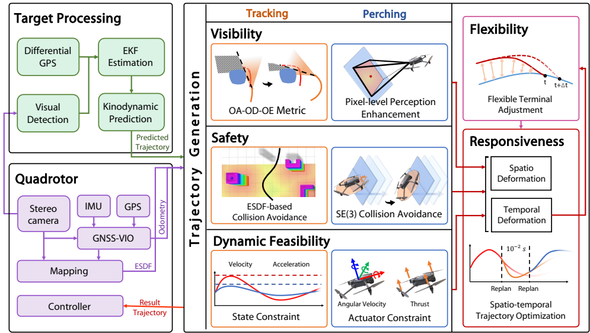

这篇论文《Adaptive Tracking and Perching for Quadrotor in Dynamic Scenarios》提出了一种创新的无人机动态跟踪与栖息系统，旨在解决移动平台上四旋翼无人机的自主栖息问题。以下是详细内容总结：

---

### **一、研究背景与挑战**
1. **应用需求**：无人机与移动平台协同作业在物流配送（如卡车-无人机系统）、巡检和搜救等领域需求迫切，但受限于续航能力，需频繁降落到移动平台充电或休息。传统方法要求平台完全停止，而本研究实现动态场景下的无缝栖息。
2. **核心挑战**：
   - **可见性维护**：高速运动中目标易脱离视野或被遮挡。
   - **终端状态同步**：需与动态平台的位置、速度、姿态全状态对齐。
   - **实时响应**：复杂环境下需高效轨迹优化以满足动态变化。

---

### **二、系统架构与关键技术**
1. **系统组成**（图2）：
   - **感知层**：融合视觉检测（厘米级精度）与差分GPS（米级精度），通过EKF预测目标轨迹。
   - **规划层**：集成可见性感知、安全避障、动力学可行性约束。
   - **执行层**：基于时空优化的轨迹生成与控制。

   

2. **关键创新**：
   - **弹性可见性规划**（图4）：
     - **观测距离（OD）**：约束水平/垂直跟踪距离（式8-9）。
     - **观测角度（OA）**：优化偏航角使目标居中（式11-12）。
     - **遮挡避免（OE）**：通过球状区域近似视锥，结合ESDF动态调整轨迹（式17-18）。

     

   - **柔性终端调整**：
     - 动态调整接触时刻的终端状态（位置、速度、姿态），引入切向相对速度松弛策略（式46-47）解决约束冲突（图7）。
     - SE(3)碰撞避免：几何建模无人机为圆盘，平台为半空间（式20-21）。

     

   - **高效时空优化框架**：
     - 采用MINCO多项式轨迹表示，联合优化空间与时间参数（式53）。
     - 通过惩罚函数处理连续/离散约束（式56-61），提升实时性。

---

### **三、实验验证**
1. **仿真对比**：
   - **跟踪性能**（图10-11）：在遮挡密集场景中，相比Fast-Tracker、Jeon等方法，本方案将目标保持在视野中心，且计算效率提升（表II）。
   - **栖息性能**（图12-13）：对比Paneque的NLP和Mao的QP方法，本方案在90°倾斜表面栖息时计算耗时降低90%（表IV），且满足推力与角速度约束。

   

2. **实物部署**：
   - **平台**：商用无人机DJI-MAVIC3与SUV移动平台（图18），仅依赖板载计算资源。
   - **结果**：
     - 30 km/h高速跟踪与栖息（图20），终端误差14.2 cm。
     - 60°倾斜表面栖息（图21），验证大姿态同步能力。

     

---

### **四、贡献与意义**
1. **学术价值**：
   - 首个完整解决动态场景下全状态同步栖息问题的系统。
   - 提出弹性可见性度量与终端松弛策略，平衡性能与可行性。
2. **工业应用**：在资源受限的商用无人机上实现部署，推动学术成果落地。

---

### **五、未来方向**
- 扩展至多机协同栖息。
- 增强对极端环境（如强风）的鲁棒性。

通过理论创新与工程实践的结合，该研究为无人机-移动平台协作提供了可靠解决方案。