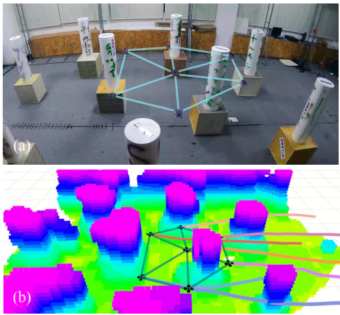
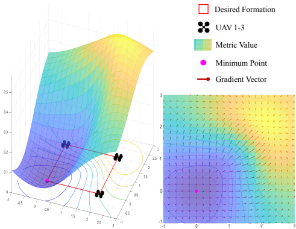
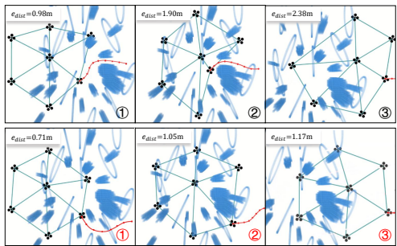
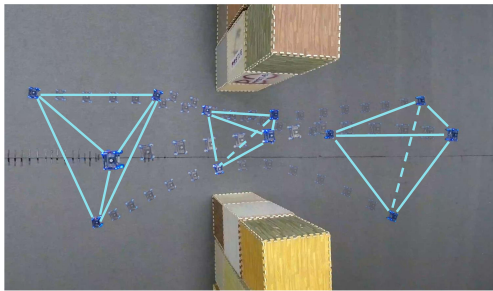

这篇论文《Distributed Swarm Trajectory Optimization for Formation Flight in Dense Environments》由Lun Quan、Longji Yin、Chao Xu和Fei Gao共同完成，提出了一种针对密集环境中无人机集群编队飞行的分布式轨迹优化方法。以下是主要内容的结构化总结：

---

### **1. 研究背景与问题**
- **应用场景**：无人机集群在搜索救援、协同建图和包裹投递等任务中需要保持特定编队，但现有方法在密集障碍物环境中缺乏有效的避障能力（如图1所示）。  
  
- **核心矛盾**：编队跟踪目标与避障需求可能冲突，传统方法（如共识控制或位置约束）无法同时兼顾两者。

---

### **2. 主要贡献**
1. **可微编队相似性度量**  
   - 基于图论提出Laplacian矩阵的Frobenius范数度量（公式4），量化当前编队与目标编队的差异，具有平移、旋转和缩放不变性（如图2）。  
     
   - 通过链式法则推导梯度（公式5-9），支持优化框架中的高效计算。

2. **时空轨迹优化框架**  
   - 采用MINCO多项式轨迹表示（公式10-12），结合以下多目标代价函数（公式13）：
     - **控制代价**（公式14-16）：最小化三阶导数（加速度变化率）。
     - **避障代价**（公式17-22）：基于ESDF（欧几里得符号距离场）动态调整轨迹。
     - **编队相似性代价**（公式23-30）：通过全局时间戳同步优化编队形状。
     - **互避代价**（公式31-36）：确保无人机间安全距离。
     - **动态可行性**：限制速度、加速度和加加速度。

3. **实验验证**  
   - **仿真对比**：在稀疏、中等和密集障碍场景中，相比Turpin[29]和Zhou[23]的方法，本文方法成功率最高（100%/95%），编队误差最小（如表I）。  
     
   - **实物实验**：七架无人机六边形编队穿越障碍区（图1）、四架无人机四面体编队通过狭窄走廊（图4），以及十架无人机心形编队大规模仿真（图5），验证了方法的鲁棒性。  
     

---

### **3. 系统实现**
- **硬件架构**（图6）：分布式无人机搭载RealSense D435相机和Xavier NX计算单元，通过广播网络共享轨迹。
- **实时性能**：优化问题通过LBFGS-Lite求解，100Hz避障检测，满足实时性要求。

---

### **4. 未来方向**
- 提升通信受限场景的鲁棒性。
- 研究死锁解除机制和任务重分配策略。
- 开源代码以促进社区研究（GitHub链接见原文）。

---

### **总结**
本文通过可微编队度量和多目标优化框架，首次实现了密集环境中无人机集群的编队飞行与避障协同，理论创新与实验验证均具有显著价值。