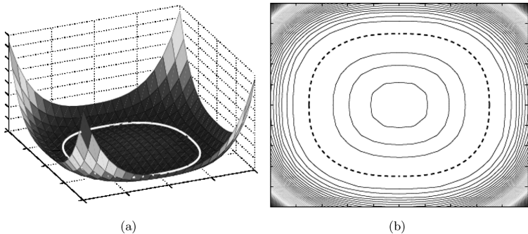
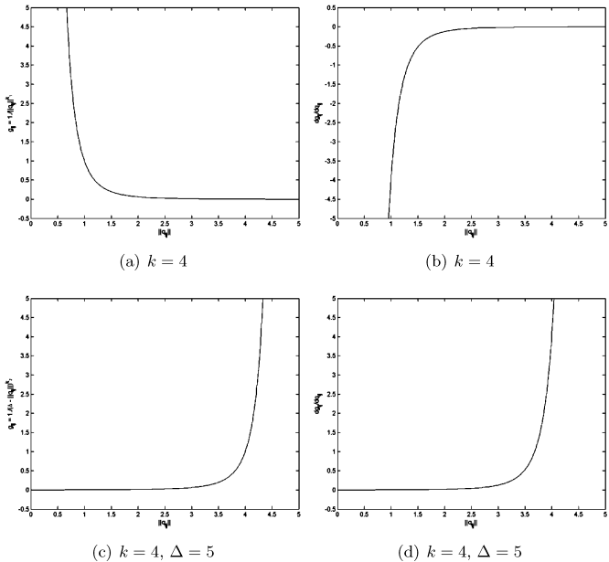
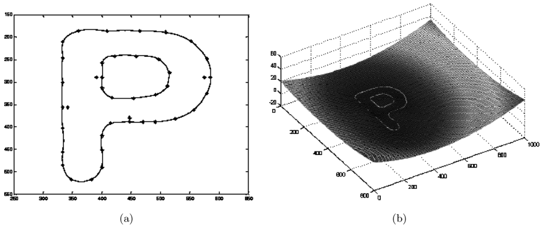
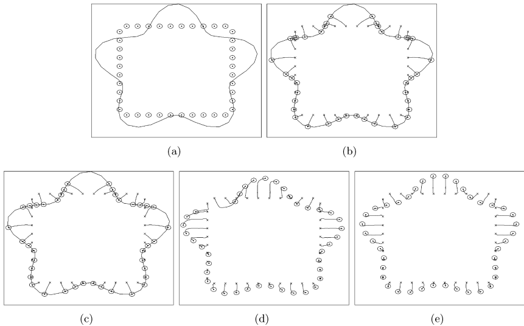
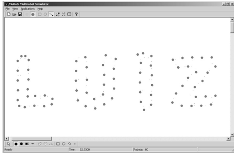

这篇论文《Decentralized controllers for shape generation with robotic swarms》由M. Ani Hsieh、Vijay Kumar和Luiz Chaimowicz合作完成，主要研究如何通过分散式控制器实现机器人群体自主形成特定二维几何图案的方法。以下是论文的详细总结：

---

### **1. 研究背景与目标**
- **应用场景**：城市环境中的自主监控（如边界巡逻）、协作搬运大型物体（通过包围目标）、隔离危险区域（如化学泄漏）等任务，需要机器人群体形成复杂二维形状。
- **核心问题**：设计分散式控制器，使机器人仅通过局部传感（无需全局状态信息或通信）即可收敛到目标边界曲线，同时满足避碰或保持特定相对距离的约束（如通信维护）。

---

### **2. 方法论**
#### **关键假设与定义**
- **边界曲线**：目标形状的边界为简单闭合光滑曲线（如星形或凸形），由隐函数 \( s(x,y)=0 \) 描述。
- **交互模型**：通过邻近图 \( \mathcal{G} \) 表示机器人间的约束关系，邻域范围由半径 \( d \) 定义（避碰时 \( d=\delta \)，距离保持时 \( d=\Delta \)）。
- **形状函数**：定义 \( f(q_i) = s(q_i)^2 \)，其零等值线对应目标边界（如图1所示）。
  

#### **控制器设计**
- **控制输入**：机器人 \( i \) 的控制器形式为：
  \[
  u_i = -\nabla_i f(q_i) - c v_i - \sum_{j \in \mathcal{N}_i} \nabla_i g_{ij}(\|q_{ij}\|)
  \]
  - **第一项**：驱动机器人向目标边界移动。
  - **第二项**：阻尼项，稳定系统。
  - **第三项**：局部交互力（避碰或距离保持）：
    - **避碰**：\( g_{ij} = \frac{1}{\|q_{ij}\|^{k_1}} \)（图2a-b）。
    - **距离保持**：\( g_{ij} = \frac{1}{(\Delta - \|q_{ij}\|)^{k_2}} \)（图2c-d）。
  

---

### **3. 理论分析**
#### **稳定性与收敛性**
- **能量函数**：定义 \( E(q,v) = \phi_{\mathcal{S}}(q) + \sum g_{ij} + \frac{1}{2}v^T v \)，证明其时间导数为负半定（\( \dot{E} = -c v^T v \)），确保系统收敛到平衡点（Proposition 5.2）。
- **平衡点性质**：
  - **无交互**（\( g_{ij}=0 \)）：机器人收敛到边界 \( \partial \mathcal{S} \)（Proposition 5.4）。
  - **避碰交互**：在满足 \( \rho_{\min} > \delta \)（边界曲率限制）时，稳定平衡仅出现在边界上（Proposition 5.5）。
  - **距离保持**：若 \( \mathcal{G}^d \) 为树状拓扑，平衡时机器人位于边界且 \( \nabla_i g_{ij} = 0 \)（Proposition 5.6）。

---

### **4. 扩展至复杂形状**
- **径向基函数（RBF）**：通过插值边界约束点生成一般形状的隐函数（如字母“P”，图3）：
  \[
  f(q) = \sum_k w_k h(\|q - q_{c_k}\|), \quad h(r) = r^2 \log(r)
  \]
  
- **局限性**：RBF可能引入局部极小值，需通过增加约束点优化梯度场。

---

### **5. 仿真结果**
- **星形边界**：40个机器人在不同交互策略下的收敛效果（图4）：
  - 无交互、仅避碰、仅距离保持（路径图拓扑）、两者结合。
  
- **复杂形状**：
  - 90个机器人沿字母“LUIZ”边界分布（图5-6）。
  - 动态形状切换（字母“GRASP”，图7）。
  
  

---

### **6. 结论与展望**
- **贡献**：提出分散式控制器，理论证明其在星形边界下的收敛性，并通过仿真验证对复杂形状的适用性。
- **未来方向**：扩展至非凸/时变边界、硬件实现中的局部定位问题、以及避免局部极小值的策略（如随机探索）。

---

### **附录**
- **机器人数量限制**：几何方法计算边界上可容纳的最大/最小机器人数量 \( N_{\max} \) 和 \( N_{\min} \)，基于交互半径 \( d \) 和边界长度。