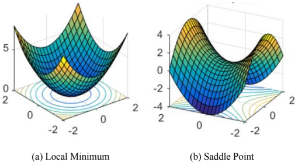

### **全面介绍：多机器人系统在复杂环境中的穿行控制综述**

这篇由Yan Gao、Chenggang Bai和Quan Quan撰写的综述论文，系统性地总结了多机器人系统在复杂环境中穿行控制的研究进展。以下是全面而结构化的介绍：

---

### **一、研究背景与核心问题**
1. **应用场景**  
   多机器人系统在森林、峡谷、室内空间、狭窄水道等复杂环境中的穿行任务（如图1所示），涉及无人机（UAV）、无人地面车辆（UGV）、无人水面/水下车辆（USV/UUV）等平台。  
   
  

2. **核心挑战**  
   - **安全性**：避免与静态/动态障碍物及其他机器人碰撞。  
   - **效率**：最小化穿行时间或路径长度。  
   - **可扩展性**：支持大规模机器人集群（如数百至数千台）。  
   - **通信与感知限制**：分布式控制下的局部信息交互（如图3所示的扇形检测区域）。  
   
  

3. **控制目标**  
   - 基本目标：防碰撞、避障。  
   - 高级目标：能耗优化、通信连通性维护、编队保持。  

---

### **二、机器人建模与假设**
1. **运动学模型**  
   - **全向模型**（如多旋翼无人机）：单/双积分器模型（公式1-3）。  
   - **非全向模型**（如车辆、固定翼无人机）：自行车模型（公式6）。  

2. **几何模型**  
   - **物理区域**（半径 \( r_p \)）：机器人实际占据空间。  
   - **安全区域**（半径 \( r_s > r_p \)）：防碰撞缓冲。  
   - **检测/通信区域**（半径 \( r_d, r_c \)）：依赖传感器与通信设备。  

3. **控制架构**  
   - **集中式**：中央节点计算全局路径，计算负担大。  
   - **分布式**：局部决策（如DARPA“马赛克战争”概念），适合大规模系统。  

---

### **三、穿行控制方法分类与对比**
#### **1. 领导者-跟随者编队控制**
- **方法**：  
  - 位移/距离/方位控制（文献[27]-[37]）。  
  - 仿射编队（图4）支持动态调整编队形状与大小。  
  
  
- **优势**：理论完备性高（图5）。  
- **局限**：扩展性差，编队重构复杂。  

#### **2. 多机器人轨迹规划**
- **单机规划**：  
  - 搜索算法（A*、RRT*）生成离散路径。  
  - 轨迹优化（B样条、MINCO）确保平滑性（图6）。  
  
  
- **多机规划**：  
  - 集中式（MIQP、MPC）：计算复杂度高。  
  - 分布式（相对安全走廊，图7）：实时性更好。  
  
  

#### **3. 基于控制的方法**
- **集群控制**：  
  - Boids模型（避撞/聚合/速度对齐）。  
  - 最优集群算法（文献[82]-[84]）。  
- **向量场控制**：  
  - 人工势场法（局部极小问题如图9）。  
  
  
  - Lyapunov引导场（图10）用于曲线跟踪。  
  
  
- **控制屏障函数（CBF）**：通过二次规划保证安全性。  

#### **4. 虚拟管规划与控制**
- **概念**：将环境抽象为无障碍通道（图11-17）。  
  
  
  
  
- **类型**：  
  - 直线/梯形/曲线/环形管（图13-15）。  
  - 组合形式（如四边形管，图16-17）。  
  
  
- **优势**：无需全局通信，适合大规模系统。  

---

### **四、未来研究方向**
1. **虚拟管扩展**：非规则形状（如网状“天空公路”）、有限视野避障（图19）。  
2. **动态环境**：实时适应移动障碍物。  
3. **异构协同**：混合无人机/地面车辆系统。  
4. **能效优化**：结合能源约束的路径规划。  

---

### **五、结论**
论文通过对比各类算法（图5）指出：  
- **虚拟管方法**在复杂环境穿行中潜力显著，兼具安全性与可扩展性。  
- **分布式控制**是未来趋势，尤其适合军事（如DARPA项目）与物流应用。  
- **跨学科融合**（如机器学习、优化理论）将推动领域进一步发展。