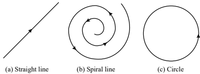
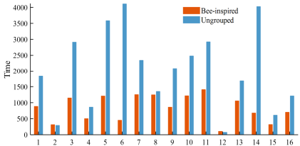
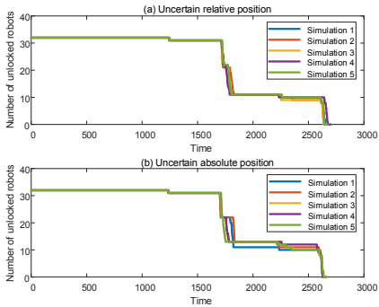
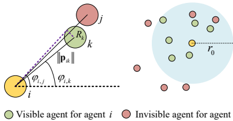
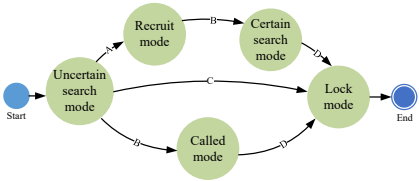
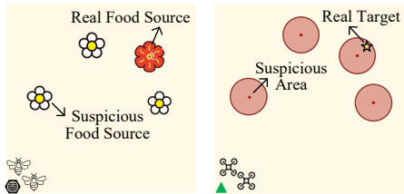
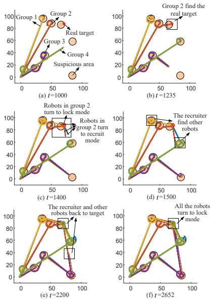

这篇论文《Swarm Robotics Search and Rescue: A Bee-Inspired Swarm Cooperation Approach without Information Exchange》提出了一种受蜜蜂群体行为启发的无信息交换群机器人协同搜救策略，主要内容可总结如下：

---

### **一、研究背景与动机**
1. **群机器人优势**：相比传统多机器人系统，群机器人具有可扩展性、鲁棒性和分布式特性，适用于农业、环境监测及搜救（SAR）等场景。但在通信受限环境中，现有方法依赖绝对定位或理想通信条件（如文献[10][13][14]），难以满足极端环境需求。
2. **核心挑战**：在无双向通信（如无线信号）条件下，如何实现多目标搜索、任务分配及目标锁定，同时应对定位误差和遮挡问题。

---

### **二、蜜蜂行为启发**
1. **类比模型**：
   - **食物源**：类比为可疑搜救区域。
   - **觅食者**：群机器人负责搜索可疑区域。
   - **招募者**：发现真实目标的机器人通过光学编码或“摇摆舞”行为（类似蜜蜂[20][24]）传递信息。
2. **关键创新**：无需双向通信，仅依赖局部感知和一致的行为规则。

---

### **三、方法设计**
#### **1. 多目标分组（Multi-Target Grouping）**
- **问题转化**：将多可疑区域搜索转化为多旅行商问题（MTSP），结合均值漂移（Mean-Shift）和遗传算法（GA）分组。
- **算法**：
  - **CIPA算法**：动态调整超时区域的分配优先级。
  - **分组策略**：根据时间或机器人数量限制优化搜索路径（Algorithm 1 & 2）。

#### **2. 有限状态机（FSM）设计**
- **五种行为模式**（Table I）：
  - **不确定搜索模式**：按分配序列搜索可疑区域，采用直线-螺旋-圆形轨迹（图4）。
    

  - **招募模式**：发现目标后，机器人转为招募者，估计其他子群位置并传递信息。
  - **被召模式**：接收目标信息后转向搜索。
  - **确定搜索模式**：在目标附近螺旋搜索。
  - **锁定模式**：环绕真实目标。

#### **3. 分布式控制律**
- **Boids模型改进**：结合六种速度分量（如趋近引导线、避碰、高度控制），通过饱和函数生成最终速度指令（式6-7）。
- **鲁棒性**：权重策略适应不同模式（如不确定搜索模式需保持群体紧密）。

---

### **四、仿真验证**
1. **实验设置**（Table II）：
   - 32个机器人在100×100地图搜索8个可疑区域（半径6）。
   - 对比分组与未分组策略，首次发现目标时间提升44.21%（图7）。
     

2. **鲁棒性测试**：
   - **目标位置误差**：97.18%成功率（192次仿真）。
   - **相对/绝对定位误差**：在噪声（$\mathcal{N}(0,0.01)$）和漂移（$\mathcal{N}(0,10^{-6}t/\Delta t)$）下仍有效（图8）。
     

---

### **五、结论与展望**
1. **贡献**：提出首个无通信依赖的群机器人SAR框架，结合分组算法、FSM和分布式控制，适用于极端环境。
2. **未来方向**：扩展至复杂地图、误识别（如虚假目标）及动态威胁场景。

---

### **关键图表与模型**
- **感知模型**：机器人感知范围与遮挡（图1）。
  

- **行为流程**：FSM状态转换（图5）。

## 信息传递详解

在论文提出的蜜蜂启发的群机器人搜救策略中，信息传递机制是核心创新之一，其设计完全避免了传统双向通信（如无线网络），转而依赖**局部感知**和**行为编码**。以下是信息传递的详细机制：

---

### **一、信息传递的生物学基础**
1. **蜜蜂“摇摆舞”启发**：
   - 蜜蜂通过舞蹈动作传递食物源的方向和距离信息（文献[22][23]）。
   - 论文类比此行为，设计机器人通过**光学编码**或**特定运动轨迹**传递目标位置。

---

### **二、信息传递的具体实现**
#### **1. 传递场景**
- **触发条件**：当某个机器人（称为“招募者”）在不确定搜索模式下发现真实目标后，切换至**招募模式**。
- **传递内容**：目标位置坐标 \( \hat{p}_t \)（可能含误差）。

#### **2. 传递方式**
- **光学编码**：
  - 招募者通过LED等光学信号编码目标位置（类似文献[20][24]）。
  - 其他机器人通过视觉传感器解码信息。
  
- **行为模仿**：
  - 招募者执行特定运动轨迹（如周期性绕圈或直线往返），模拟蜜蜂的“摇摆舞”。
  - 轨迹参数（如方向、频率）隐含目标位置信息（图6(d)展示传递瞬间）。
    
    

#### **3. 传递流程**
1. **目标发现**：机器人A在可疑区域发现目标，记录位置 \( p_t \)。
2. **角色转换**：A转为招募者，根据预设规则分配任务（如“前往区域X招募其他机器人”）。
3. **主动搜索**：招募者快速移动至预估的子群位置（依赖初始任务一致性）。
4. **信息传递**：
   - 当招募者感知到其他机器人（通过局部相对定位，式2-4），启动光学/行为编码。
   - 重复传递多次以提高可靠性（应对遮挡或噪声）。
5. **接收信息**：被招募机器人解码信息后，放弃当前任务，转向目标区域（进入**被召模式**）。

---

### **三、技术保障与鲁棒性**
1. **局部感知模型**：
   - 机器人仅感知半径 \( r_0 \) 内的邻居（式2），避免全局通信。
   - 遮挡模型（式3）确保信息传递在可见范围内有效。
     
     

2. **误差容错**：
   - 目标位置 \( \hat{p}_t \) 允许误差（仿真中验证了10%误差下的成功率）。
   - 相对定位噪声（\( \mathcal{N}(0,0.01) \)）下仍能稳定传递（图8(a)）。

3. **分布式一致性**：
   - 所有机器人预加载相同地图和任务序列，确保招募者对子群位置的预估一致。

---

### **四、与传统方法的对比**
| **特性**               | **传统通信（如无线）**       | **本论文方法**               |
|------------------------|------------------------------|------------------------------|
| 依赖条件               | 稳定的双向网络               | 仅需局部视觉感知             |
| 信息类型               | 数字信号（易受干扰）         | 光学/行为编码（抗干扰）      |
| 鲁棒性                 | 通信中断则失效               | 容忍定位误差和部分遮挡       |
| 扩展性                 | 需协调频道资源               | 无冲突风险（纯局部交互）     |

---

### **五、局限性**
1. **传递距离限制**：受感知半径 \( r_0 \) 约束，远距离需多次中继。
2. **动态环境适应性**：未考虑移动障碍物对光学信号的干扰。
3. **解码复杂度**：行为编码需机器人具备较高的轨迹解析能力。

---

### **关键图表**
- **信息传递过程**：图6(d)展示招募者（红色）通过行为编码向其他机器人传递目标位置。
