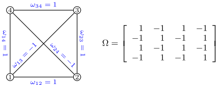
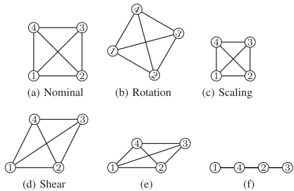
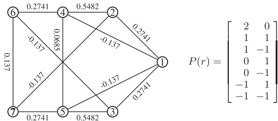
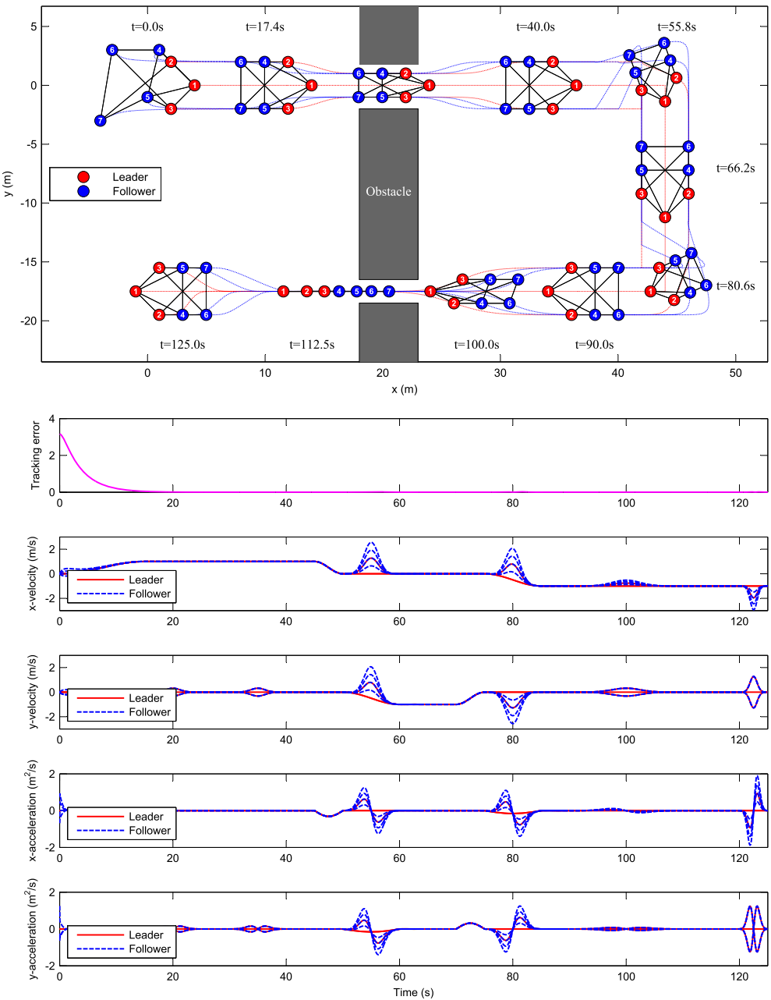

# 多智能体系统的仿射编队机动控制研究综述

## 研究背景与意义
这篇论文由Shiyu Zhao提出了一种基于应力矩阵的仿射编队机动控制新方法，用于解决多智能体系统的编队控制问题。传统编队控制通常包含两个子任务：形成期望几何模式(编队形状控制)和实现集体机动(编队机动控制)。现有方法如基于位移、距离和方位的方法各有局限性，难以同时实现编队平移、旋转、缩放和形状变形等多种机动行为。

## 核心创新点
论文的主要创新在于：
1. 提出了基于应力矩阵的仿射编队机动控制方法，能够同时实现编队形状控制和机动控制
2. 解决了领导者选择问题，引入了"仿射可定位性"概念，并给出了必要和充分条件
3. 针对单积分器、双积分器和独轮车模型提出了多种分布式控制律
4. 证明了所提控制律的全局稳定性，且不需要全局参考系(如果测量可以在每个智能体的局部参考系中进行)

## 理论基础
### 应力矩阵
应力矩阵可以看作具有正负边权的广义图拉普拉斯矩阵。与常规图拉普拉斯矩阵不同，应力矩阵中的边权可以是正、负或零。应力矩阵对编队配置的任何仿射变换保持不变，这为实现各种编队机动行为提供了强大工具。



### 仿射变换与目标编队
目标编队定义为标称配置的时变仿射变换：
```
p*(t) = [I_n⊗A(t)]r + 1_n⊗b(t)
```
其中r是标称配置，A(t)和b(t)分别表示线性变换和平移。仿射变换可以对应平移、旋转、缩放、剪切或其组合。



## 控制方法
### 单积分器模型控制律
1. **静止领导者**：基本控制律(11)能保证跟踪误差全局指数收敛
2. **恒定速度领导者**：加入积分项的PI控制律(14)可消除跟踪误差
3. **时变速度领导者**：需要绝对速度反馈的控制律(20)可保证零跟踪误差

### 双积分器模型控制律
1. **零加速度领导者**：基本控制律(21)能保证全局指数收敛
2. **恒定加速度领导者**：PI控制律(24)可消除跟踪误差
3. **时变加速度领导者**：需要绝对加速度反馈的控制律(25)可保证零跟踪误差

### 带约束的编队控制
论文还研究了非完整运动和速度饱和约束下的编队控制问题，提出了针对独轮车模型(二维和三维)的控制律，并证明了其全局稳定性。



## 仿真与实现
论文提供了详细的实现方法和仿真示例，展示了编队如何通过狭窄通道等障碍物时，连续改变其质心、方向、比例和几何模式。仿真验证了所提控制律的有效性。



## 结论与展望
该论文提出的基于应力矩阵的方法为多智能体编队机动控制提供了新思路，能够实现更灵活的编队变换。未来研究方向包括考虑更复杂的智能体动力学、运动约束和有向基础图等情况。