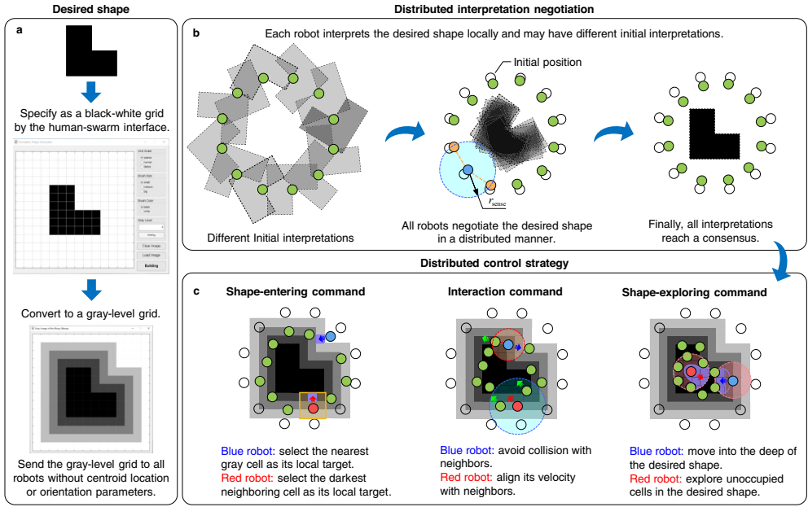
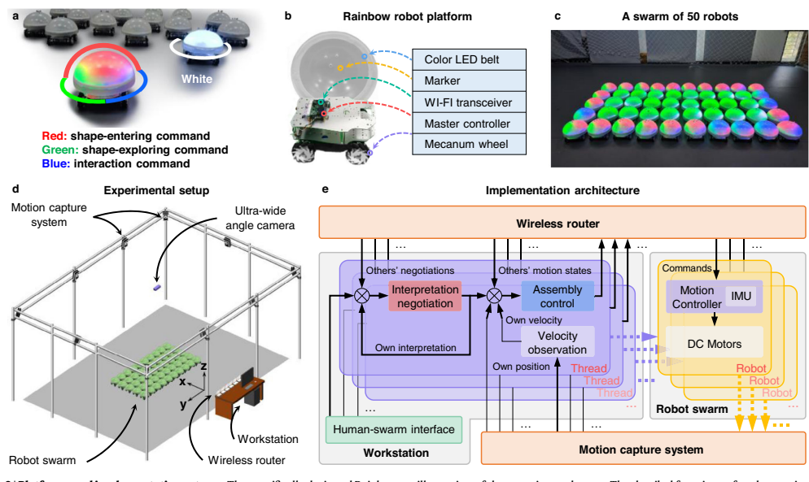
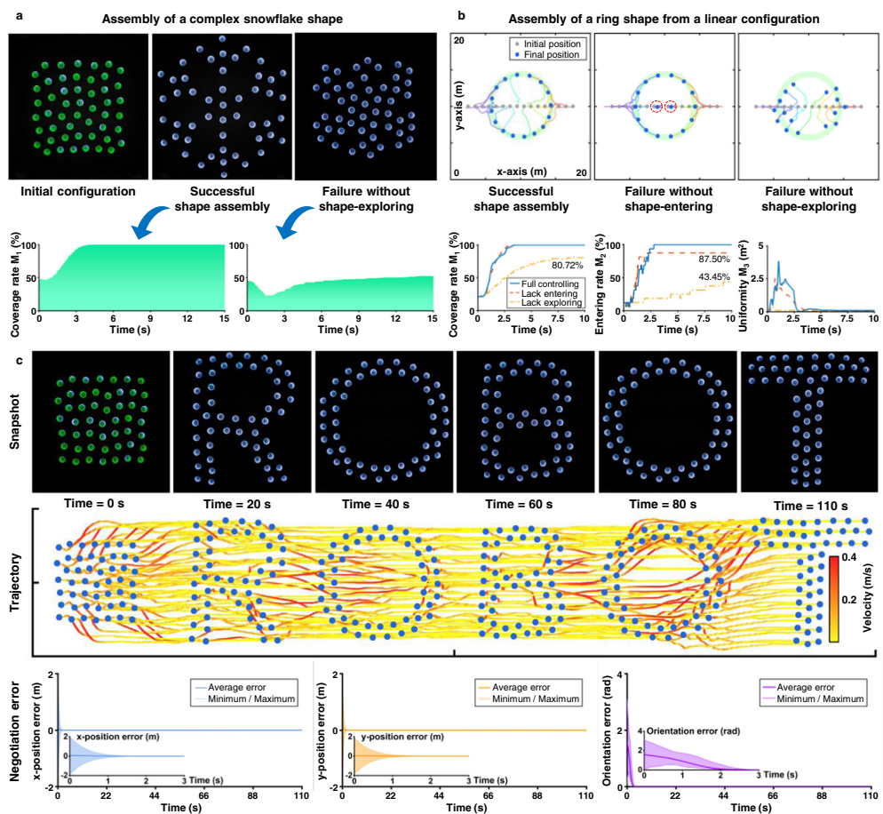
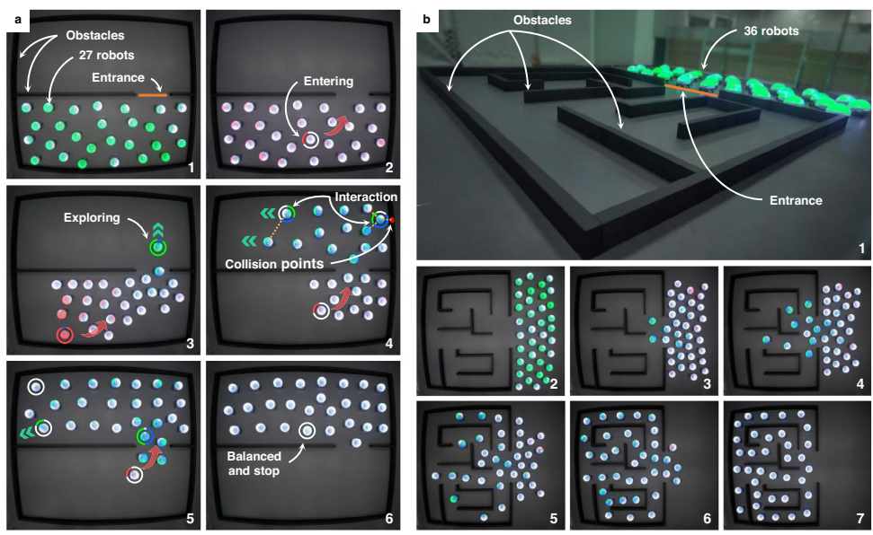

这篇论文提出了一种基于均值漂移探索（mean-shift exploration）的机器人群体形状自组装策略，通过分布式协商和控制算法实现复杂形状的高效组装。以下是主要内容总结：

---

### 1. **核心创新**
- **均值漂移探索机制**：当机器人被邻近机器人和未占用位置包围时，会主动放弃当前位置，向目标形状中未占用位置密度最高的区域移动。该机制通过改进机器学习中的均值漂移算法实现，解决了传统方法中机器人易陷入局部最优的问题。
- **无目标分配**：与传统基于目标分配的方法不同，该策略无需为每个机器人预先分配目标位置，避免了计算复杂性和冲突问题。

---

### 2. **技术实现**
- **人机交互界面**：用户通过图形化界面指定目标形状，系统将其转换为非参数化网格（灰度网格），通过距离变换算法平滑扩展形状影响范围。
- **分布式协商算法**：机器人通过局部无线通信协商形状的位置和方向，最终达成全局共识。引入少量“知情机器人”可引导群体跟踪动态轨迹。
- **分布式控制算法**：  
  - **速度命令分解**：包括形状进入（$v_i^{\text{ent}}$）、形状探索（$v_i^{\text{exp}}$）和交互（$v_i^{\text{int}}$）三部分。  
  - **关键设计**：形状探索命令通过均值漂移算法驱动机器人向未占用区域移动，避免局部阻塞。

---

### 3. **实验验证**
- **复杂形状组装**：成功组装高度非凸的雪花形状（覆盖率100%），禁用探索命令时覆盖率降至75%（图3a）。  
- **适应性**：  
  - **群体规模变化**：机器人数量与形状网格数不匹配时仍能稳定组装（图5d-e）。  
  - **形状再生**：移除部分机器人后，剩余机器人自发填补空缺（图5b-c）。  
- **协同运输**：通过空心形状包围货物，群体跟踪移动轨迹运输货物（图6）。  
- **环境探索**：在迷宫等复杂环境中均匀分布，避免死锁（图7）。

---

### 4. **性能对比**
- **效率优势**：与基于目标分配的方法（如文献12）和无目标分配方法（如文献21）相比，在300个机器人规模下，收敛时间缩短至少20倍（图4）。  
- **指标评估**：覆盖率（$M_1$）、进入率（$M_2$）、分布均匀性（$M_3$）和速度极化（$M_4$）量化性能。

---

### 5. **应用扩展**
- **动态形状跟踪**：通过知情机器人引导群体跟踪移动形状。  
- **实际场景**：适用于协同运输、环境探索（如迷宫填充）等任务。

---

### 6. **局限性与展望**
- **单连通形状限制**：当前仅支持单一连通区域的形状组装。  
- **硬件依赖**：实验依赖外部运动捕捉系统，未来需开发完全分布式的硬件方案。

---

### 总结
该策略通过均值漂移探索和分布式协商，实现了高效、自适应的群体形状组装，在复杂形状、动态环境和规模变化中表现出色，为大规模机器人系统提供了新思路。